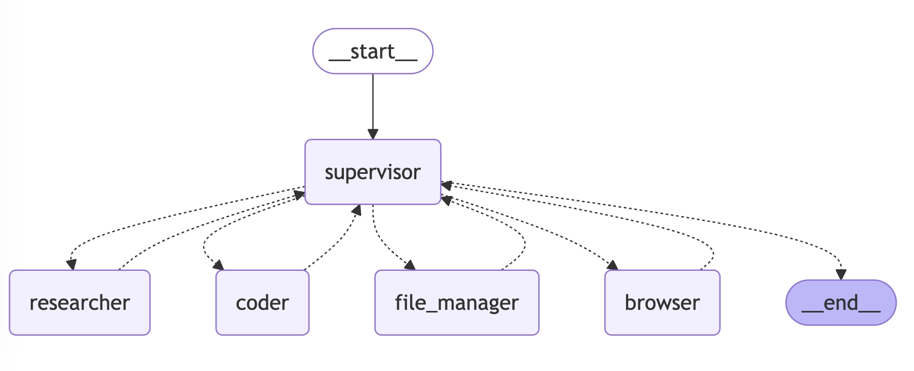

# LangManus

> Come From Open Source, Back to Open Source

LangManus is a community-driven AI automation framework that builds upon the incredible work of the open source community. Our goal is to combine language models with specialized tools for tasks like web search, crawling, and Python code execution, while giving back to the community that made this possible.

## Architecture

LangManus implements a hierarchical multi-agent system where a supervisor coordinates specialized agents to accomplish complex tasks:



The system consists of:
- **Supervisor**: Orchestrates the workflow and delegates tasks
- **Researcher**: Handles web searches and information gathering
- **Coder**: Manages code generation and modification
- **File Manager**: Handles file system operations
- **Browser**: Performs web crawling and interaction

## Features

- 🤖 LLM-powered automation using open source models like Qwen (with OpenAI compatibility)
- 🔍 Web search capabilities via Tavily
- 🕷️ Web crawling support through Jina
- 🐍 Python code execution and REPL integration
- 📊 Workflow graph visualization and management

## Why LangManus?

We believe in the power of open source collaboration. This project wouldn't be possible without the amazing work of projects like:
- [Qwen](https://github.com/QwenLM/Qwen) for their open source LLMs
- [Tavily](https://tavily.com/) for search capabilities
- [Jina](https://jina.ai/) for neural search technology
- And many other open source contributors

We're committed to giving back to the community and welcome contributions of all kinds - whether it's code, documentation, bug reports, or feature suggestions.

## Setup

### Prerequisites

- Python 3.12 or higher
- [uv](https://github.com/astral-sh/uv) package manager

### Install Dependencies

LangManus leverages [uv](https://github.com/astral-sh/uv) as its package manager to streamline dependency management.
Follow the steps below to set up a virtual environment and install the necessary dependencies:

```bash
# Step 1: Create and activate a virtual environment
python -m venv .venv

# On Unix/macOS:
source .venv/bin/activate

# On Windows:
.venv\Scripts\activate

# Step 2: Install project dependencies
uv sync
```

By completing these steps, you'll ensure your environment is properly configured and ready for development.

### Configure Environment Variables

LangManus uses a two-tier LLM system with separate configurations for supervisor and agent roles. Create a `.env` file in the project root and configure the following environment variables:

```ini
# Supervisor LLM Configuration (defaults to qwen-max-latest)
SUPERVISOR_MODEL=qwen-max-latest
SUPERVISOR_API_KEY=your_supervisor_api_key
SUPERVISOR_BASE_URL=your_custom_base_url  # Optional

# Agent LLM Configuration (defaults to qwen2.5-vl-72b-instruct)
AGENT_MODEL=qwen2.5-vl-72b-instruct
AGENT_API_KEY=your_agent_api_key
AGENT_BASE_URL=your_custom_base_url  # Optional

# Tool API Keys
TAVILY_API_KEY=your_tavily_api_key
JINA_API_KEY=your_jina_api_key  # Optional

# Browser Configuration
CHROME_INSTANCE_PATH=/Applications/Google Chrome.app/Contents/MacOS/Google Chrome  # Optional, path to Chrome executable
```

> **Note:**
>
> - The system uses different models for supervision (Qwen-max by default) and agent tasks (Qwen-VL by default)
> - You can customize the base URLs for both supervisor and agent LLMs independently
> - Supervisor and agent can use different API keys if needed
> - Jina API key is optional. Provide your own key to access a higher rate limit
> - Tavily search is configured to return a maximum of 5 results by default

You can copy the `.env.example` file as a template to get started:

```bash
cp .env.example .env
```

### Configure Pre-commit Hook
LangManus includes a pre-commit hook that runs linting and formatting checks before each commit. To set it up:

1. Make the pre-commit script executable:
```bash
chmod +x pre-commit
```

2. Install the pre-commit hook:
```bash
ln -s ../../pre-commit .git/hooks/pre-commit
```

The pre-commit hook will automatically:
- Run linting checks (`make lint`)
- Run code formatting (`make format`)
- Add any reformatted files back to staging
- Prevent commits if there are any linting or formatting errors

## Usage

### Basic Execution

To run LangManus with default settings:

```bash
uv run main.py
```

### Advanced Configuration

LangManus can be customized through various configuration files in the `src/config` directory:
- `env.py`: Configure LLM models, API keys, and base URLs
- `tools.py`: Adjust tool-specific settings (e.g., Tavily search results limit)
- `agents.py`: Modify team composition and agent system prompts

### Agent Prompts System

LangManus uses a sophisticated prompting system in the `src/prompts` directory to define agent behaviors and responsibilities:

#### Core Agent Roles

- **Supervisor ([`src/prompts/supervisor.md`](src/prompts/supervisor.md))**: Coordinates the team and delegates tasks by analyzing requests and determining which specialist should handle them. Makes decisions about task completion and workflow transitions.

- **Researcher ([`src/prompts/researcher.md`](src/prompts/researcher.md))**: Specializes in information gathering through web searches and data collection. Uses Tavily search and web crawling capabilities while avoiding mathematical computations or file operations.

- **Coder ([`src/prompts/coder.md`](src/prompts/coder.md))**: Professional software engineer role focused on Python and bash scripting. Handles:
  - Python code execution and analysis
  - Shell command execution
  - Technical problem-solving and implementation

- **File Manager ([`src/prompts/file_manager.md`](src/prompts/file_manager.md))**: Handles all file system operations with a focus on properly formatting and saving content in markdown format.

- **Browser ([`src/prompts/browser.md`](src/prompts/browser.md))**: Web interaction specialist that handles:
  - Website navigation
  - Page interaction (clicking, typing, scrolling)
  - Content extraction from web pages

#### Prompt System Architecture

The prompts system uses a template engine ([`src/prompts/template.py`](src/prompts/template.py)) that:
- Loads role-specific markdown templates
- Handles variable substitution (e.g., current time, team member information)
- Formats system prompts for each agent

Each agent's prompt is defined in a separate markdown file, making it easy to modify behavior and responsibilities without changing the underlying code.

## Contributing

We welcome contributions of all kinds! Whether you're fixing a typo, improving documentation, or adding a new feature, your help is appreciated. Here's how you can contribute:

1. Fork the repository
2. Create your feature branch (`git checkout -b feature/amazing-feature`)
3. Commit your changes (`git commit -m 'Add some amazing feature'`)
4. Push to the branch (`git push origin feature/amazing-feature`)
5. Open a Pull Request

Please feel free to:
- Report bugs or suggest features through issues
- Improve documentation
- Share your experience using LangManus
- Help others in discussions

## License

This project is open source and available under the [MIT License](LICENSE).

## Acknowledgments

Special thanks to all the open source projects and contributors that make LangManus possible. We stand on the shoulders of giants.
